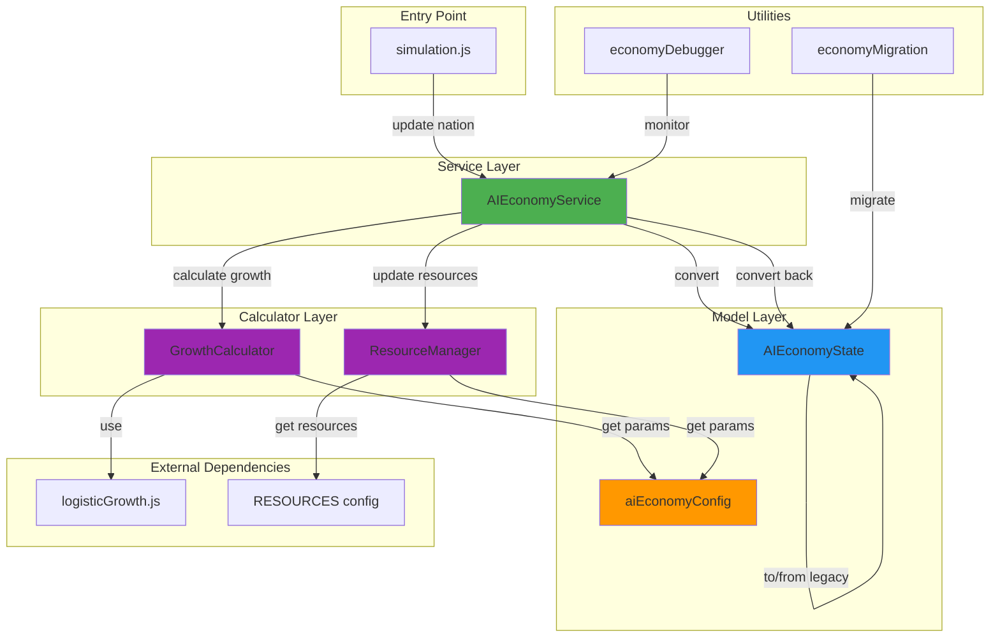
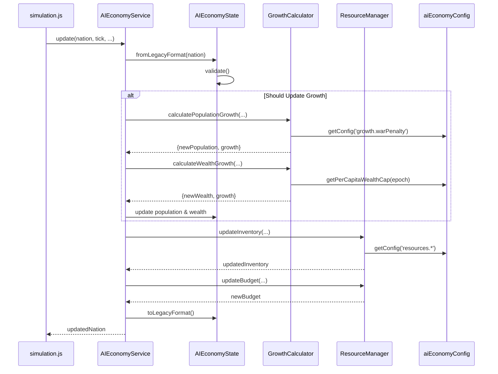
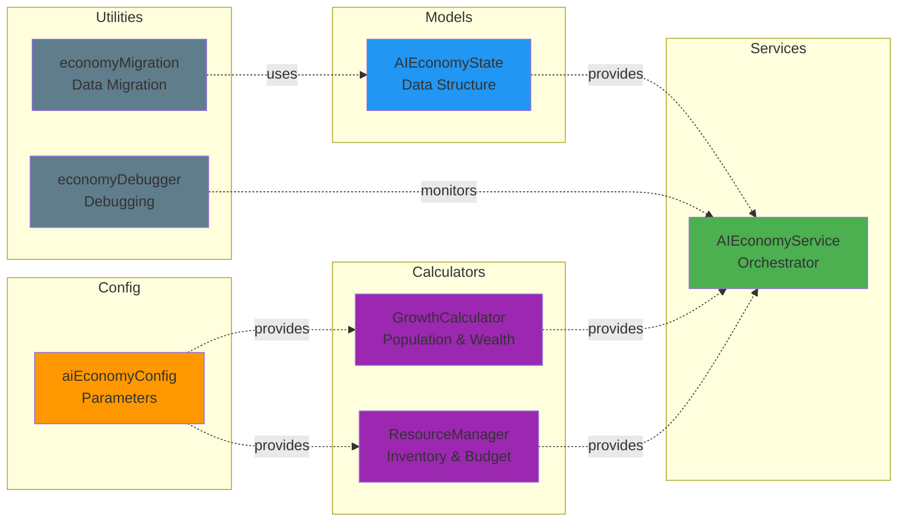
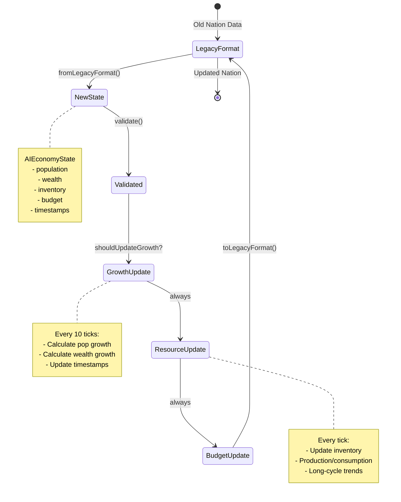
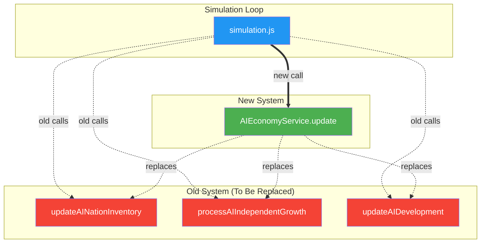

# AI Economy System Architecture

## System Overview



## Data Flow



## Module Responsibilities



## Configuration Structure

```mermaid
graph TD
    CONFIG[aiEconomyConfig]
    
    CONFIG --> GROWTH[growth]
    CONFIG --> WEALTH[wealth]
    CONFIG --> EPOCH[epoch]
    CONFIG --> RESOURCES[resources]
    CONFIG --> DIFFICULTY[difficulty]
    CONFIG --> SOFTCAPS[softCaps]
    
    GROWTH --> G1[baseRate: 0.02]
    GROWTH --> G2[warPenalty: 0.3]
    GROWTH --> G3[updateInterval: 10]
    GROWTH --> G4[minimumGrowth: {...}]
    
    WEALTH --> W1[perCapitaCaps: {...}]
    WEALTH --> W2[baseGrowthRate: 0.01]
    WEALTH --> W3[budgetRatio: 0.5]
    
    RESOURCES --> R1[baseInventoryTarget: 500]
    RESOURCES --> R2[baseProductionRate: 5.0]
    RESOURCES --> R3[warConsumptionMultiplier: 1.3]
    
    style CONFIG fill:#FF9800
    style GROWTH fill:#4CAF50
    style WEALTH fill:#2196F3
    style RESOURCES fill:#9C27B0
```

## State Lifecycle



## Integration Points



## Migration Strategy

```mermaid
graph LR
    subgraph "Phase 1: Preparation"
        P1[Create New Modules]
        P2[Add Tests]
        P3[Add Documentation]
    end
    
    subgraph "Phase 2: Integration"
        I1[Add Feature Flag]
        I2[Parallel Run]
        I3[Compare Results]
    end
    
    subgraph "Phase 3: Rollout"
        R1[Enable for New Games]
        R2[Enable for All]
        R3[Remove Old Code]
    end
    
    P1 --> P2 --> P3
    P3 --> I1 --> I2 --> I3
    I3 --> R1 --> R2 --> R3
    
    style P1 fill:#4CAF50
    style P2 fill:#4CAF50
    style P3 fill:#4CAF50
    style I1 fill:#FF9800
    style I2 fill:#FF9800
    style I3 fill:#FF9800
    style R1 fill:#2196F3
    style R2 fill:#2196F3
    style R3 fill:#2196F3
```



---

**Note**: These diagrams use Mermaid syntax and can be rendered in:
- GitHub (native support)
- VS Code (with Mermaid extension)
- Online editors (mermaid.live)
- Documentation sites (GitBook, Docusaurus, etc.)
