# 扩展产业链系统设计稿

本设计旨在构建一个**真正长而丰富的产业链体系**，涵盖从石器时代到信息时代的完整产业演进，引入新资源、建筑、科技和社会阶层，形成环环相扣的产业网络。

---

## 设计理念

### 核心原则
1. **时代演进**：每个时代解锁新的产业层级，后续产业依赖前期基础
2. **环环相扣**：原材料 → 初级加工 → 高级制造 → 最终消费，层层递进
3. **阶层分化**：不同产业孕育不同阶层，阶层反哺产业发展
4. **瓶颈与平衡**：缺失任一环节都会造成产业链断裂

---

## 一、新增资源 (30+种)

### 石器时代 (Epoch 0) - 基础资源
| 资源ID | 名称 | 类型 | 描述 |
|--------|------|------|------|
| `flax` | 亚麻 | raw_material | 纺织业的原始纤维来源 |
| `clay` | 粘土 | raw_material | 陶器和砖块的基础原料 |
| `animal_hide` | 兽皮 | raw_material | 早期皮革制品的来源 |

### 青铜时代 (Epoch 1) - 金属与畜牧
| 资源ID | 名称 | 类型 | 描述 |
|--------|------|------|------|
| `tin` | 锡矿 | raw_material | 与铜合金制造青铜 |
| `bronze` | 青铜 | industrial | 铜锡合金，早期金属制品 |
| `wool` | 羊毛 | raw_material | 畜牧业产出的纺织原料 |
| `leather` | 皮革 | manufactured | 加工后的兽皮 |
| `pottery` | 陶器 | manufactured | 粘土烧制的容器 |

### 古典时代 (Epoch 2) - 文化与奢侈
| 资源ID | 名称 | 类型 | 描述 |
|--------|------|------|------|
| `marble` | 大理石 | raw_material | 高端建筑材料 |
| `olive_oil` | 橄榄油 | manufactured | 食用与灯油 |
| `incense` | 香薰 | luxury | 宗教与贵族用品 |
| `glass` | 玻璃 | industrial | 沙与碱烧制而成 |
| `silk_raw` | 蚕丝 | raw_material | 高端纺织原料 |

### 封建时代 (Epoch 3) - 封建经济
| 资源ID | 名称 | 类型 | 描述 |
|--------|------|------|------|
| `saltpeter` | 硝石 | raw_material | 火药的关键成分 |
| `salt` | 食盐 | essential | 食品防腐必需品 |
| `timber` | 船材 | industrial | 造船专用硬木 |
| `fur` | 毛皮 | luxury | 寒区贵重商品 |
| `mead` | 蜂蜜酒 | luxury | 北方传统酒类 |

### 探索时代 (Epoch 4) - 全球贸易
| 资源ID | 名称 | 类型 | 描述 |
|--------|------|------|------|
| `tobacco` | 烟草 | luxury | 新世界商品 |
| `sugar` | 蔗糖 | essential | 殖民地种植园产品 |
| `cotton` | 棉花 | raw_material | 新大陆纺织原料 |
| `rum` | 朗姆酒 | luxury | 糖蜜发酵酒品 |
| `porcelain` | 瓷器 | luxury | 东方贸易珍品 |
| `gunpowder` | 火药 | military | 改变战争形态的利器 |

### 启蒙时代 (Epoch 5) - 科学革命
| 资源ID | 名称 | 类型 | 描述 |
|--------|------|------|------|
| `optics` | 光学仪器 | industrial | 望远镜、显微镜 |
| `chemicals` | 化学品 | industrial | 酸碱与染料 |
| `clockwork` | 钟表机芯 | manufactured | 精密机械代表 |
| `tea` | 茶叶 | essential | 东方饮品 |
| `medicines` | 药品 | manufactured | 近代医药产品 |

### 工业时代 (Epoch 6) - 机械动力
| 资源ID | 名称 | 类型 | 描述 |
|--------|------|------|------|
| `petroleum` | 石油 | raw_material | 新能源革命 |
| `rubber` | 橡胶 | raw_material | 工业密封材料 |
| `machinery` | 机械 | industrial | 蒸汽动力设备 |
| `cement` | 水泥 | industrial | 现代建材 |
| `electricity` | 电力 | virtual | 第二次工业革命的核心 |
| `canned_food` | 罐头 | manufactured | 工业化食品 |
| `textiles_industrial` | 工业纺织品 | manufactured | 机械化纺织产品 |

### 信息时代 (Epoch 7) - 数字经济
| 资源ID | 名称 | 类型 | 描述 |
|--------|------|------|------|
| `silicon` | 硅晶 | raw_material | 芯片基础材料 |
| `electronics` | 电子元件 | industrial | 电路板与芯片 |
| `software` | 软件 | virtual | 数字产品 |
| `data` | 数据 | virtual | 信息时代的石油 |
| `pharmaceuticals` | 现代药品 | manufactured | 生物制药 |
| `plastics` | 塑料 | manufactured | 石化产品 |

---

## 二、产品转化链路图（核心）

这是产业链的**核心**——展示每种原材料如何经过多级加工最终成为制成品。

### 1. 纺织品产业链路图 🧵

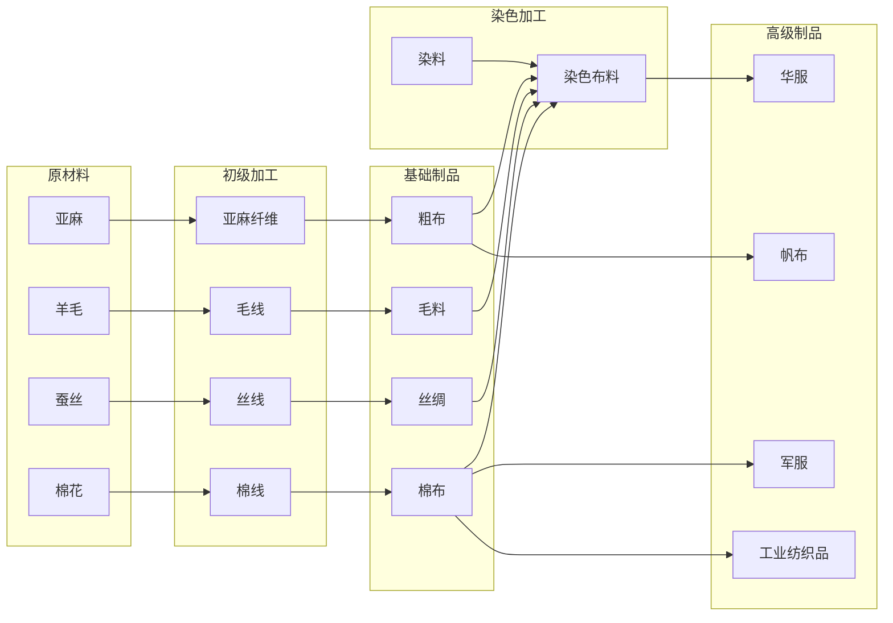

**详细转化路径：**
| 起点 | 加工1 | 加工2 | 加工3 | 最终产品 |
|------|-------|-------|-------|----------|
| 亚麻 → | 亚麻纤维 → | 粗布 → | 染色 → | **帆布/麻袋** |
| 羊毛 → | 毛线 → | 毛料 → | 染色 → | **华服/毛毯** |
| 蚕丝 → | 丝线 → | 丝绸 → | 刺绣 → | **丝绸华服** |
| 棉花 → | 棉线 → | 棉布 → | 染色 → | **棉衣/工业纺织品** |

---

### 2. 冶金产业链路图 ⚙️

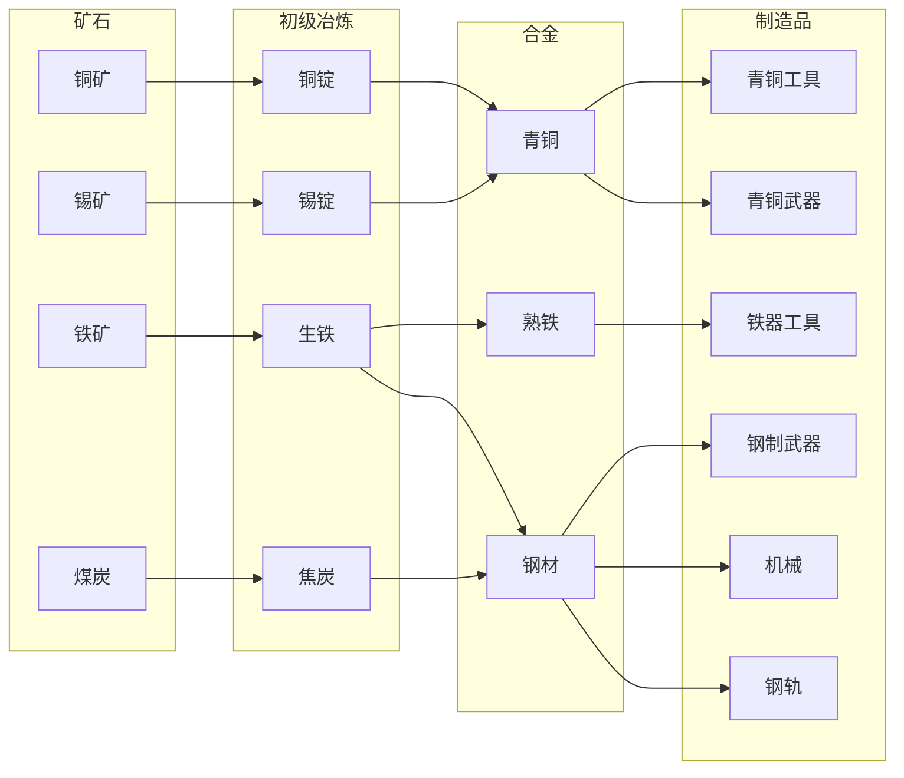

**详细转化路径：**
| 起点 | 加工1 | 加工2 | 加工3 | 加工4 | 最终产品 |
|------|-------|-------|-------|-------|----------|
| 铜矿+锡矿 → | 铜锭+锡锭 → | 青铜 → | 锻造 → | — | **青铜工具/武器** |
| 铁矿 → | 生铁 → | 熟铁 → | 锻打 → | — | **铁器工具** |
| 铁矿+煤炭 → | 生铁+焦炭 → | 钢材 → | 锻压 → | 精加工 → | **钢制武器/机械** |
| 铁矿+煤炭 → | 生铁+焦炭 → | 钢材 → | 轧制 → | — | **钢轨/钢梁** |

---

### 3. 食品产业链路图 🍞

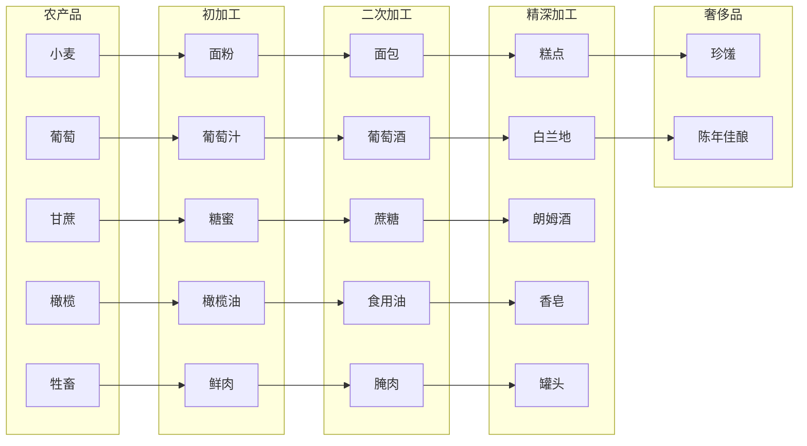

**详细转化路径：**
| 起点 | 加工1 | 加工2 | 加工3 | 加工4 | 最终产品 |
|------|-------|-------|-------|-------|----------|
| 小麦 → | 面粉 → | 面包 → | 烘焙 → | 配料装饰 → | **糕点/珍馐** |
| 葡萄 → | 葡萄汁 → | 发酵 → | 陈酿 → | 蒸馏 → | **白兰地** |
| 甘蔗 → | 糖蜜 → | 蔗糖 → | 发酵 → | 蒸馏 → | **朗姆酒** |
| 橄榄 → | 榨取 → | 橄榄油 → | 皂化 → | — | **香皂** |
| 牲畜 → | 屠宰 → | 鲜肉 → | 腌制/烟熏 → | 装罐密封 → | **罐头** |

---

### 4. 建材产业链路图 🧱

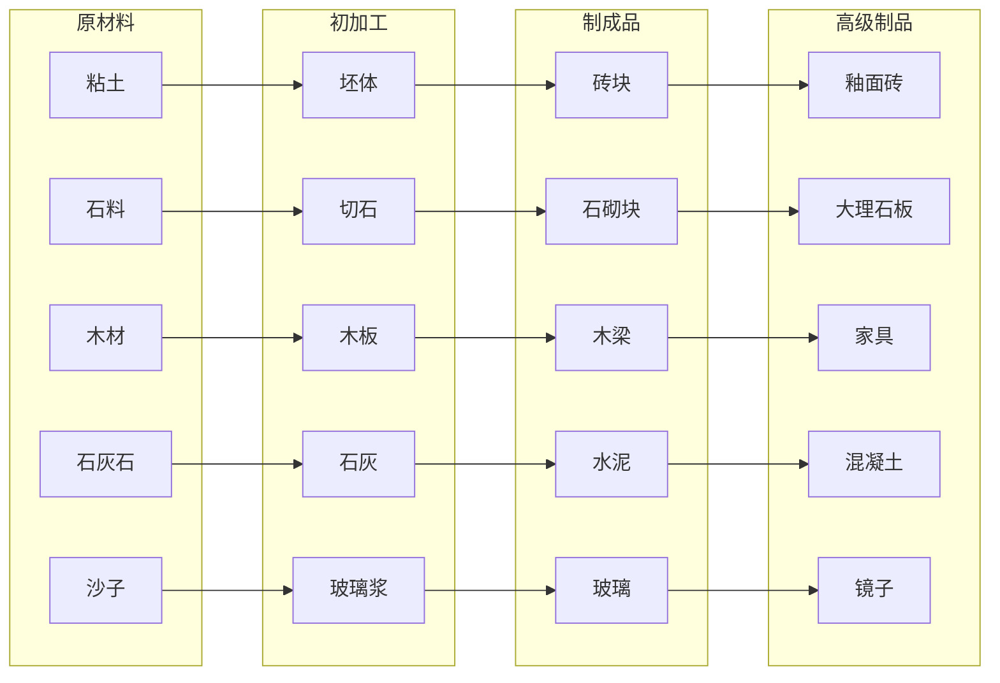

**详细转化路径：**
| 起点 | 加工1 | 加工2 | 加工3 | 加工4 | 最终产品 |
|------|-------|-------|-------|-------|----------|
| 粘土 → | 制坯 → | 烧制 → | 砖块 → | 上釉 → | **釉面砖/瓷砖** |
| 石料 → | 切割 → | 打磨 → | 石砌块 → | 抛光雕刻 → | **大理石板/雕像** |
| 木材 → | 锯切 → | 木板 → | 干燥处理 → | 雕刻拼接 → | **家具** |
| 石灰石+粘土 → | 研磨 → | 煅烧 → | �ite料 → | 加水 → | **水泥/混凝土** |
| 沙子+碱 → | 熔化 → | 成型 → | 玻璃 → | 镀银 → | **镜子** |

---

### 5. 皮革产业链路图 👜

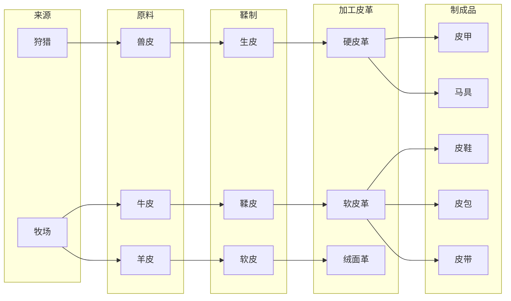

**详细转化路径：**
| 起点 | 加工1 | 加工2 | 加工3 | 加工4 | 最终产品 |
|------|-------|-------|-------|-------|----------|
| 兽皮 → | 去毛 → | 鞣制 → | 硬化 → | 裁剪缝制 → | **皮甲/马具** |
| 牛皮 → | 浸泡 → | 鞣制 → | 染色 → | 制作成型 → | **皮鞋/皮带** |
| 羊皮 → | 脱脂 → | 鞣制 → | 软化 → | 缝制 → | **皮包/手套** |

---

### 6. 陶瓷产业链路图 🏺

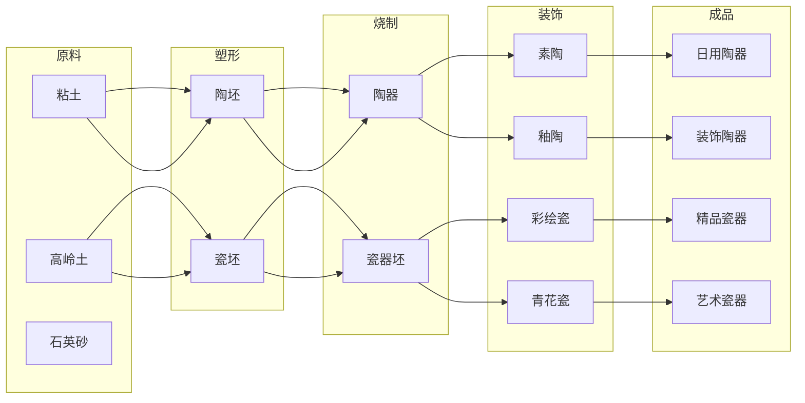

**详细转化路径：**
| 起点 | 加工1 | 加工2 | 加工3 | 加工4 | 最终产品 |
|------|-------|-------|-------|-------|----------|
| 粘土 → | 揉制 → | 塑形 → | 低温烧制 → | — | **素陶** |
| 粘土 → | 揉制 → | 塑形 → | 烧制 → | 上釉二次烧 → | **釉陶** |
| 高岭土 → | 淘洗 → | 拉坯 → | 素烧 → | 釉烧 → | **白瓷** |
| 高岭土 → | 淘洗 → | 拉坯 → | 绘制 → | 高温烧成 → | **青花瓷** |

---

### 7. 化工产业链路图 🧪

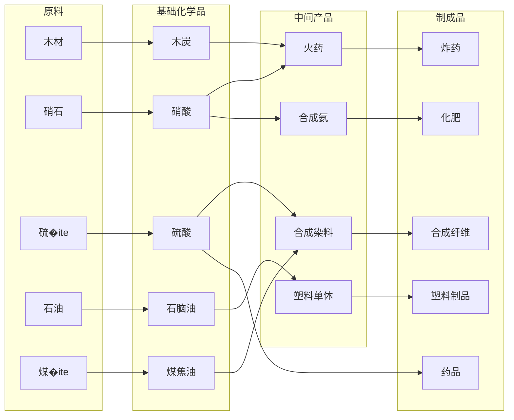

**详细转化路径：**
| 起点 | 加工1 | 加工2 | 加工3 | 加工4 | 最终产品 |
|------|-------|-------|-------|-------|----------|
| 硝石+硫+木炭 → | 研磨混合 → | 成型 → | — | — | **黑火药** |
| 硝石 → | 酸化 → | 硝酸 → | 与有机物反应 → | — | **炸药/TNT** |
| 煤焦油 → | 蒸馏 → | 苯 → | 硝化/磺化 → | — | **合成染料** |
| 石油 → | 裂解 → | 乙烯 → | 聚合 → | 成型 → | **塑料制品** |
| 空气+天然气 → | 合成 → | 氨 → | 与酸反应 → | — | **化肥** |

---

### 8. 军工产业链路图 ⚔️

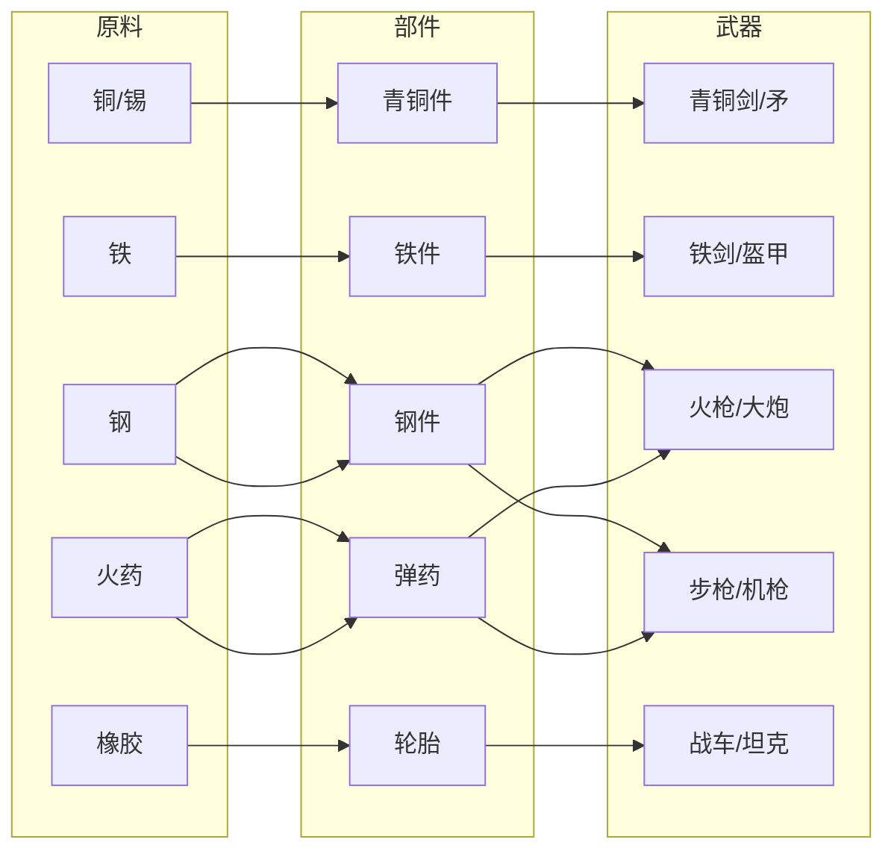

**详细转化路径：**
| 起点 | 加工1 | 加工2 | 加工3 | 加工4 | 最终产品 |
|------|-------|-------|-------|-------|----------|
| 铜+锡 → | 熔炼青铜 → | 铸造 → | 淬火 → | 磨制 → | **青铜武器** |
| 铁矿 → | 冶炼 → | 锻打 → | 淬火 → | 装配 → | **铁质武器/盔甲** |
| 钢材+木材 → | 枪管制造 → | 枪托制作 → | 装配 → | 测试 → | **火枪** |
| 钢材+火药 → | 炮管铸造 → | 炮架制作 → | 装配 → | 校准 → | **火炮** |
| 钢材+机械 → | 枪机制造 → | 枪管制作 → | 自动装置 → | 组装 → | **机枪** |

---

### 9. 能源产业链路图 ⚡

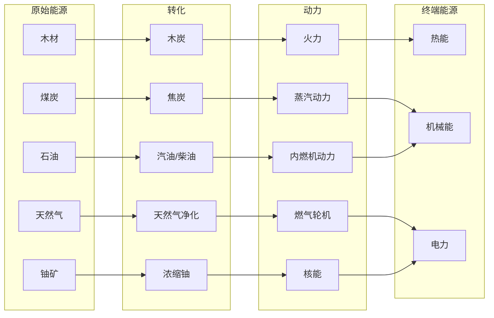

**详细转化路径：**
| 起点 | 加工1 | 加工2 | 加工3 | 加工4 | 最终产品 |
|------|-------|-------|-------|-------|----------|
| 木材 → | 干馏 → | 木炭 → | 燃烧 → | — | **热能** (冶炼/烹饪) |
| 煤炭 → | 燃烧 → | 产生蒸汽 → | 驱动蒸汽机 → | — | **机械动力** |
| 石油 → | 分馏 → | 汽油 → | 驱动内燃机 → | — | **机械动力** |
| 煤炭/石油 → | 燃烧 → | 产生蒸汽 → | 驱动汽轮机 → | 发电机 → | **电力** |
| 铀矿 → | 浓缩 → | 核裂变 → | 产生热量 → | 发电 → | **电力** |

---

### 10. 造纸-印刷产业链路图 📚

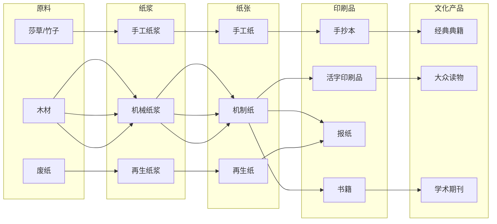

**详细转化路径：**
| 起点 | 加工1 | 加工2 | 加工3 | 加工4 | 最终产品 |
|------|-------|-------|-------|-------|----------|
| 莎草 → | 切割浸泡 → | 捶打 → | 压制成片 → | 干燥 → | **莎草纸** |
| 木材 → | 削片 → | 蒸煮制浆 → | 漂白 → | 抄造干燥 → | **机制纸** |
| 纸张+墨 → | 排版 → | 印刷 → | 装订 → | — | **书籍** |
| 纸张+墨 → | 快速排版 → | 轮转印刷 → | 折叠 → | — | **报纸** |

---

### 11. 玻璃-光学产业链路图 🔭

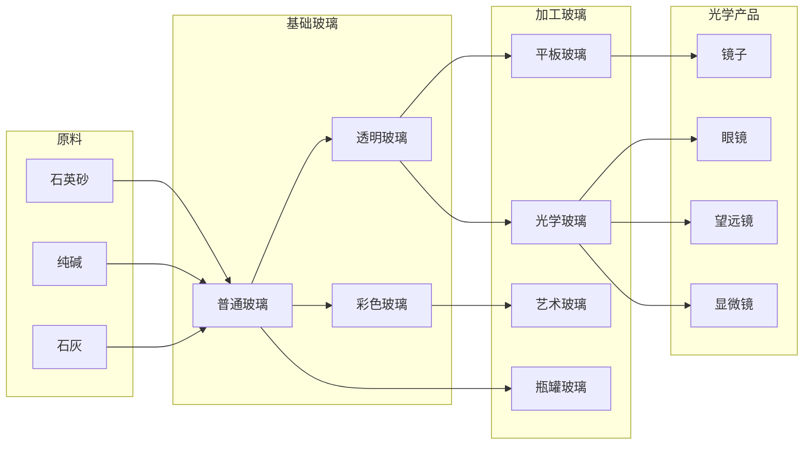

**详细转化路径：**
| 起点 | 加工1 | 加工2 | 加工3 | 加工4 | 最终产品 |
|------|-------|-------|-------|-------|----------|
| 石英砂+纯碱+石灰 → | 熔化 → | 成型 → | 退火 → | 平整 → | **平板玻璃** |
| 平板玻璃 → | 抛光 → | 镀银/铝 → | 保护层 → | — | **镜子** |
| 高纯石英砂 → | 精炼熔化 → | 成型 → | 研磨 → | 镀膜 → | **光学镜片** |
| 光学镜片 → | 装配 → | 校准 → | — | — | **望远镜/显微镜** |

---

### 12. 金融产业链路图 🏦

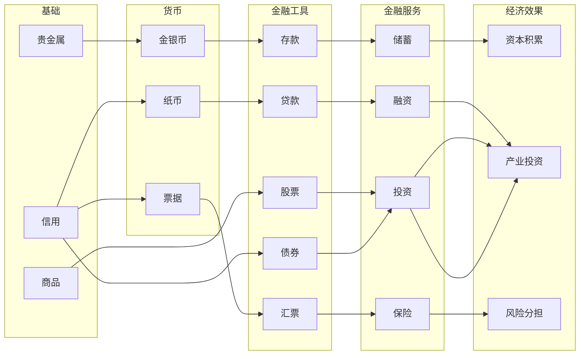

**详细转化路径：**
| 起点 | 加工1 | 加工2 | 加工3 | 加工4 | 最终产品 |
|------|-------|-------|-------|-------|----------|
| 贵金属 → | 铸币 → | 存入银行 → | 产生利息 → | — | **资本积累** |
| 信用 → | 发行纸币 → | 贷款 → | 投资生产 → | 产出增加 → | **产业发展** |
| 商品 → | 估值 → | 发行股票 → | 交易 → | 筹集资金 → | **股权融资** |
| 信用 → | 发行债券 → | 借贷 → | 利息偿还 → | — | **债务融资** |

---

## 完整产品转化表

### 按最终用途分类

#### 消费品转化链
| 最终产品 | ← 中间品3 | ← 中间品2 | ← 中间品1 | ← 原材料 |
|----------|-----------|-----------|-----------|----------|
| **面包** | ← 烘焙 | ← 发酵面团 | ← 面粉 | ← 小麦 |
| **葡萄酒** | ← 陈酿 | ← 发酵 | ← 葡萄汁 | ← 葡萄 |
| **华服** | ← 裁缝 | ← 染色布料 | ← 布料 | ← 亚麻/羊毛/丝 |
| **家具** | ← 组装 | ← 雕刻 | ← 木板 | ← 木材 |
| **瓷器** | ← 釉烧 | ← 彩绘 | ← 素瓷 | ← 高岭土 |
| **皮鞋** | ← 缝制 | ← 裁剪 | ← 皮革 | ← 牛皮 |

#### 工业品转化链
| 最终产品 | ← 中间品3 | ← 中间品2 | ← 中间品1 | ← 原材料 |
|----------|-----------|-----------|-----------|----------|
| **钢轨** | ← 轧制 | ← 钢材 | ← 生铁+焦炭 | ← 铁矿+煤炭 |
| **蒸汽机** | ← 组装 | ← 机械部件 | ← 钢材 | ← 铁矿+煤炭 |
| **火枪** | ← 装配 | ← 枪管+枪托 | ← 钢材+木材 | ← 铁矿+木材 |
| **塑料** | ← 聚合 | ← 乙烯 | ← 石脑油 | ← 石油 |
| **电力** | ← 发电 | ← 蒸汽 | ← 燃烧 | ← 煤炭/石油 |

#### 文化品转化链
| 最终产品 | ← 中间品3 | ← 中间品2 | ← 中间品1 | ← 原材料 |
|----------|-----------|-----------|-----------|----------|
| **书籍** | ← 装订 | ← 印刷 | ← 排版 | ← 纸张+油墨 |
| **报纸** | ← 发行 | ← 印刷 | ← 采编 | ← 纸张+油墨 |
| **望远镜** | ← 组装 | ← 镜片研磨 | ← 光学玻璃 | ← 石英砂 |

---

## 三、扩展产业链 (12条主线 + 6条支线)

### 1. 畜牧-皮革产业链 🐑
```
[石器] 狩猎场 → 兽皮
         ↓
[青铜] 牧场 → 羊毛/牛皮
         ↓
[古典] 制革坊 → 皮革
         ↓
[封建] 皮具工坊 → 皮革制品(马具/铠甲衬里)
         ↓
[启蒙] 制鞋工场 → 皮鞋
         ↓
[工业] 皮革厂 → 工业皮革/皮带
```

**涉及阶层**：牧民(新)、制革匠(新)

---

### 2. 陶瓷-玻璃产业链 🏺
```
[石器] 粘土坑 → 粘土
         ↓
[青铜] 陶窑 → 陶器
         ↓
[古典] 玻璃坊 → 玻璃
         ↓         ↓
[封建] 釉陶窑  →  彩色玻璃
         ↓         ↓
[探索] 瓷器作坊 → 瓷器
         ↓
[工业] 玻璃厂 → 工业玻璃/镜片
```

**涉及阶层**：陶工(新)

---

### 3. 盐业产业链 🧂
```
[青铜] 盐田 → 粗盐
         ↓
[古典] 盐仓 → 精盐
         ↓
[封建] 盐商行 → 腌制食品
         ↓
[探索] 盐务局 → 官盐专卖
         ↓
[工业] 化工厂 → 工业氯化钠
```

**特殊机制**：盐税为国家重要财政来源

---

### 4. 烟酒产业链 🍷
```
[古典] 葡萄园 → 葡萄
         ↓
        酿酒坊 → 葡萄酒
         ↓
[封建] 蒸馏坊 → 烈酒/白兰地
         ↓
[探索] 甘蔗园 → 糖蜜 → 朗姆酒
        烟草园 → 烟叶 → 烟草制品
         ↓
[启蒙] 烟酒行 → 专卖税
         ↓
[工业] 酿酒厂 → 工业化酒类
        卷烟厂 → 香烟
```

**涉及阶层**：酿酒师(新)、烟商(新)

---

### 5. 军工产业链 ⚔️
```
[青铜] 武器铺 → 青铜武器
         ↓
[古典] 盔甲坊 → 铜甲
         ↓
[封建] 铁匠铺 → 铁质武器/板甲
         ↓
[探索] 火药坊 → 火药 → 火枪/大炮
         ↓
[启蒙] 兵工厂 → 标准化火器
         ↓
[工业] 军火工厂 → 机枪/火炮
        造船厂 → 铁甲舰
         ↓
[信息] 军工复合体 → 导弹/电子战设备
```

**涉及阶层**：军械师(新)、军官(升级自士兵)

---

### 6. 交通运输产业链 🚂
```
[青铜] 独木舟 → 河运
         ↓
[古典] 帆船坞 → 海运
         ↓
[封建] 驿站 → 陆路物流
        马厩 → 骑乘马匹
         ↓
[探索] 大型船坞 → 远洋帆船
         ↓
[启蒙] 运河 → 内河航运
        马车行 → 长途运输
         ↓
[工业] 铁路枢纽 → 铁路网络
        蒸汽船厂 → 蒸汽轮船
         ↓
[信息] 航空港 → 航空物流
        物流中心 → 现代供应链
```

**涉及阶层**：车夫(新)、船长(升级自航海家)、铁路工人(新)

---

### 7. 能源产业链 ⚡
```
[青铜] 薪柴 → 木炭
         ↓
[封建] 水车 → 水力
         ↓
[启蒙] 风车 → 风力磨坊
         ↓
[工业] 煤矿 → 煤炭 → 蒸汽动力
        油田 → 石油 → 内燃机
         ↓
[信息] 发电厂 → 电力
        核电站 → 核能
        太阳能/风电 → 清洁能源
```

**涉及建筑**：煤气灯(城市照明)、发电厂、电网

---

### 8. 化工产业链 🧪
```
[古典] 染料提取 → 天然染料
         ↓
[封建] 火药坊 → 硝石提取
         ↓
[探索] 炼金术坊 → 酸碱制备
         ↓
[启蒙] 化学实验室 → 化学品
         ↓
[工业] 化工厂 → 合成染料
        硫酸厂 → 工业化学品
        炼油厂 → 石油化工
         ↓
[信息] 生化工厂 → 塑料/合成纤维
        制药厂 → 现代药品
```

**涉及阶层**：化学师(新)、药剂师(新)

---

### 9. 通信-传媒产业链 📰
```
[古典] 信使驿站 → 官方通信
         ↓
[封建] 钟楼 → 报时系统
         ↓
[探索] 邮驿 → 公共邮政
         ↓
[启蒙] 印刷所 → 报纸/书籍
        咖啡馆 → 公共舆论
         ↓
[工业] 电报局 → 电报网络
        报社 → 大众传媒
         ↓
[信息] 广播站 → 广播网络
        电视台 → 电视媒体
        互联网中心 → 数字媒体
```

**涉及阶层**：记者(新)、通信员(新)

---

### 10. 金融产业链 🏦
```
[青铜] 钱庄 → 货币兑换
         ↓
[古典] 高利贷商 → 私人借贷
         ↓
[封建] 当铺 → 典当业
         ↓
[探索] 银行 → 存款/贷款
        保险社 → 海运保险
         ↓
[启蒙] 中央银行 → 货币发行
        证券交易所 → 股票/债券
         ↓
[工业] 投资银行 → 工业融资
        保险公司 → 现代保险
         ↓
[信息] 金融中心 → 金融衍生品
        数字银行 → 电子支付
```

**涉及阶层**：银行家(新)、证券经纪人(新)

---

### 11. 医疗卫生产业链 🏥
```
[青铜] 巫医 → 原始医疗
         ↓
[古典] 医馆 → 草药医疗
         ↓
[封建] 修道院医院 → 慈善医疗
         ↓
[启蒙] 药剂师 → 近代药品
        解剖学院 → 医学研究
         ↓
[工业] 医院 → 现代医疗
        制药厂 → 工业化药品
         ↓
[信息] 医疗中心 → 专科医疗
        生物实验室 → 疫苗/基因治疗
```

**涉及阶层**：医生(新)、护士(新)

---

### 12. 教育科研产业链 🎓
```
[青铜] 长老会 → 口述传统
         ↓
[古典] 学院/书院 → 经典教育
         ↓
[封建] 修道院学校 → 宗教教育
         ↓
[探索] 航海学院 → 专业教育
         ↓
[启蒙] 大学 → 高等教育
        科学院 → 基础研究
         ↓
[工业] 工学院 → 应用技术
        研究所 → 专业研究
         ↓
[信息] 研究型大学 → 前沿科学
        企业研发中心 → 商业研发
```

**涉及阶层**：教授(新)、研究员(新)、学生(新)

---

## 三、新增建筑 (60+种)

### 采集类 (Gather)

#### 石器时代
| 建筑ID | 名称 | 产出 | 岗位 |
|--------|------|------|------|
| `hunting_camp` | 狩猎营地 | 兽皮, 食物 | 猎人×2 |
| `clay_pit` | 粘土坑 | 粘土 | 工人×2 |
| `flax_field` | 亚麻田 | 亚麻 | 农民×2 |

#### 青铜时代
| 建筑ID | 名称 | 产出 | 岗位 |
|--------|------|------|------|
| `tin_mine` | 锡矿井 | 锡矿 | 矿工×3 |
| `pasture` | 牧场 | 羊毛, 牛皮 | 牧民×3 |
| `salt_pan` | 盐田 | 粗盐 | 工人×2 |

#### 古典时代
| 建筑ID | 名称 | 产出 | 岗位 |
|--------|------|------|------|
| `marble_quarry` | 大理石矿场 | 大理石 | 矿工×4 |
| `olive_grove` | 橄榄园 | 橄榄 | 农民×3 |
| `silk_farm` | 蚕房 | 蚕丝 | 工人×2 |

#### 封建时代
| 建筑ID | 名称 | 产出 | 岗位 |
|--------|------|------|------|
| `saltpeter_bed` | 硝石床 | 硝石 | 工人×2 |
| `fur_trading_post` | 毛皮交易站 | 毛皮 | 商人×1, 猎人×2 |

#### 探索时代
| 建筑ID | 名称 | 产出 | 岗位 |
|--------|------|------|------|
| `sugar_plantation` | 甘蔗种植园 | 蔗糖 | 佃农×6, 商人×1 |
| `tobacco_plantation` | 烟草种植园 | 烟草 | 佃农×4, 商人×1 |
| `cotton_field` | 棉花田 | 棉花 | 农民×4 |
| `tea_plantation` | 茶园 | 茶叶 | 农民×3 |

#### 工业时代
| 建筑ID | 名称 | 产出 | 岗位 |
|--------|------|------|------|
| `oil_well` | 油井 | 石油 | 工人×6, 工程师×1 |
| `rubber_plantation` | 橡胶园 | 橡胶 | 佃农×4 |

#### 信息时代
| 建筑ID | 名称 | 产出 | 岗位 |
|--------|------|------|------|
| `silicon_mine` | 硅矿 | 硅晶 | 工程师×2, 工人×4 |
| `data_center` | 数据中心 | 数据 | 研究员×3, 工程师×2 |

---

### 工业类 (Industry)

#### 石器时代
| 建筑ID | 名称 | 输入 | 产出 | 岗位 |
|--------|------|------|------|------|
| `tanning_pit` | 鞣皮坑 | 兽皮, 粘土 | 皮革 | 工人×2 |

#### 青铜时代
| 建筑ID | 名称 | 输入 | 产出 | 岗位 |
|--------|------|------|------|------|
| `tin_smelter` | 锡熔炉 | 锡矿, 木材 | 青铜(与铜) | 工匠×2 |
| `pottery_kiln` | 陶窑 | 粘土, 木材 | 陶器 | 陶工×2 |
| `wool_spinner` | 纺羊毛坊 | 羊毛 | 毛线 | 工人×2 |

#### 古典时代
| 建筑ID | 名称 | 输入 | 产出 | 岗位 |
|--------|------|------|------|------|
| `glass_furnace` | 玻璃熔炉 | 沙(石料), 木材 | 玻璃 | 工匠×3 |
| `oil_press` | 榨油坊 | 橄榄/亚麻 | 橄榄油/亚麻油 | 工人×2 |
| `incense_maker` | 香薰坊 | 香料, 油 | 香薰 | 工匠×1 |
| `silk_weaver` | 丝织坊 | 蚕丝, 染料 | 丝绸 | 工匠×3 |

#### 封建时代
| 建筑ID | 名称 | 输入 | 产出 | 岗位 |
|--------|------|------|------|------|
| `glazed_kiln` | 釉陶窑 | 陶器, 染料 | 釉陶 | 陶工×2, 工匠×1 |
| `stained_glass` | 彩玻工坊 | 玻璃, 染料 | 彩色玻璃 | 工匠×2 |
| `gunpowder_mill` | 火药坊 | 硝石, 硫�ite, 木炭 | 火药 | 工匠×3 |
| `distillery` | 蒸馏坊 | 美酒/糖蜜 | 烈酒/朗姆酒 | 酿酒师×2 |
| `shipyard` | 船坞 | 船材, 铁, 布料 | 船只 | 工人×6, 工匠×2 |

#### 探索时代
| 建筑ID | 名称 | 输入 | 产出 | 岗位 |
|--------|------|------|------|------|
| `porcelain_kiln` | 瓷窑 | 粘土(高岭土), 木材 | 瓷器 | 陶工×4 |
| `rum_distillery` | 朗姆酒厂 | 蔗糖, 水 | 朗姆酒 | 酿酒师×3 |
| `cannon_foundry` | 炮铸坊 | 铜/铁, 火药 | 火炮 | 军械师×3 |
| `musket_workshop` | 火枪作坊 | 铁, 木材, 火药 | 火枪 | 军械师×2 |

#### 启蒙时代
| 建筑ID | 名称 | 输入 | 产出 | 岗位 |
|--------|------|------|------|------|
| `chemical_lab` | 化学实验室 | 各种原料 | 化学品 | 化学师×2, 学者×1 |
| `clockmaker` | 钟表坊 | 铜/铁, 玻璃 | 钟表机芯 | 工匠×2 |
| `optics_workshop` | 光学工坊 | 玻璃, 铜 | 光学仪器 | 工匠×2, 学者×1 |
| `pharmacy` | 药剂坊 | 草药, 化学品 | 药品 | 药剂师×2 |

#### 工业时代
| 建筑ID | 名称 | 输入 | 产出 | 岗位 |
|--------|------|------|------|------|
| `oil_refinery` | 炼油厂 | 石油 | 汽油, 沥青 | 工程师×3, 工人×8 |
| `cement_plant` | 水泥厂 | 石灰石, 粘土, 煤炭 | 水泥 | 工人×6 |
| `rubber_factory` | 橡胶厂 | 橡胶 | 轮胎, 密封件 | 工人×4 |
| `textile_mill` | 纺织厂 | 棉花/羊毛 | 工业纺织品 | 工人×12, 资本家×1 |
| `canning_factory` | 罐头厂 | 食物, 铁 | 罐头 | 工人×8 |
| `machinery_works` | 机械厂 | 钢材, 煤炭 | 机械 | 工程师×4, 工人×10 |
| `power_plant` | 发电厂 | 煤炭/石油 | 电力 | 工程师×5, 工人×8 |
| `arms_factory` | 军工厂 | 钢材, 机械 | 武器 | 军械师×3, 工人×10 |

#### 信息时代
| 建筑ID | 名称 | 输入 | 产出 | 岗位 |
|--------|------|------|------|------|
| `chip_fab` | 芯片厂 | 硅晶, 化学品 | 电子元件 | 工程师×6, 研究员×2 |
| `software_studio` | 软件工作室 | 电力, 数据 | 软件 | 研究员×4 |
| `pharma_lab` | 生物制药 | 化学品 | 现代药品 | 化学师×2, 研究员×3 |
| `plastics_plant` | 塑料厂 | 石油 | 塑料 | 工程师×2, 工人×6 |

---

### 市政类 (Civic)

#### 青铜时代
| 建筑ID | 名称 | 功能 | 岗位 |
|--------|------|------|------|
| `money_changer` | 钱庄 | 货币兑换 | 商人×1 |

#### 古典时代
| 建筑ID | 名称 | 功能 | 岗位 |
|--------|------|------|------|
| `academy` | 学院 | 科研+文化 | 学者×4 |
| `hospital` | 医馆 | 人口健康 | 医生×2 |
| `arena` | 竞技场 | 文化+稳定 | 工人×4 |

#### 封建时代
| 建筑ID | 名称 | 功能 | 岗位 |
|--------|------|------|------|
| `monastery_hospital` | 修道院医院 | 医疗+文化 | 神职×2, 医生×1 |
| `post_station` | 驿站 | 加速物流 | 车夫×3 |
| `pawnshop` | 当铺 | 金融服务 | 商人×1 |

#### 探索时代
| 建筑ID | 名称 | 功能 | 岗位 |
|--------|------|------|------|
| `bank` | 银行 | 存贷款 | 银行家×2, 学者×1 |
| `insurance_house` | 保险社 | 海运保险 | 商人×2 |
| `post_office` | 邮局 | 公共通信 | 通信员×3 |

#### 启蒙时代
| 建筑ID | 名称 | 功能 | 岗位 |
|--------|------|------|------|
| `university` | 大学 | 高等教育 | 教授×3, 学者×2 |
| `central_bank` | 中央银行 | 货币政策 | 银行家×2, 官员×2 |
| `stock_exchange` | 证券交易所 | 资本市场 | 证券经纪人×4 |
| `newspaper` | 报社 | 舆论影响 | 记者×3 |
| `modern_hospital` | 医院 | 现代医疗 | 医生×4, 护士×6 |

#### 工业时代
| 建筑ID | 名称 | 功能 | 岗位 |
|--------|------|------|------|
| `telegraph_office` | 电报局 | 远程通信 | 通信员×4 |
| `engineering_school` | 工学院 | 技术教育 | 教授×2, 工程师×2 |
| `research_institute` | 研究所 | 专业研究 | 研究员×5 |
| `bus_terminal` | 公交站 | 城市交通 | 工人×3 |

#### 信息时代
| 建筑ID | 名称 | 功能 | 岗位 |
|--------|------|------|------|
| `media_center` | 媒体中心 | 数字传媒 | 记者×4, 研究员×2 |
| `fintech_hub` | 金融科技中心 | 数字金融 | 银行家×2, 研究员×3 |
| `research_university` | 研究型大学 | 前沿科学 | 教授×4, 研究员×6 |
| `medical_center` | 医疗中心 | 专科医疗 | 医生×6, 护士×10 |

---

## 四、新增社会阶层 (15+种)

### 底层阶级 (Lower Class)
| 阶层ID | 名称 | 描述 | 默认资源 | 出现时代 |
|--------|------|------|----------|----------|
| `hunter` | 猎人 | 捕猎野兽获取兽皮和食物 | 兽皮 | 石器 |
| `herder` | 牧民 | 放牧牲畜获取羊毛和皮革 | 羊毛 | 青铜 |
| `potter` | 陶工 | 烧制陶器和瓷器的手艺人 | 陶器 | 青铜 |
| `railway_worker` | 铁路工人 | 维护铁路和操作列车 | 煤炭 | 工业 |

### 中层阶级 (Middle Class)
| 阶层ID | 名称 | 描述 | 默认资源 | 出现时代 |
|--------|------|------|----------|----------|
| `tanner` | 制革匠 | 加工皮革制品的手艺人 | 皮革 | 古典 |
| `brewer` | 酿酒师 | 酿造酒类的专业人士 | 美酒 | 古典 |
| `armorer` | 军械师 | 制造武器和盔甲 | 工具 | 封建 |
| `coachman` | 车夫 | 运输货物和乘客 | 食物 | 封建 |
| `chemist` | 化学师 | 研究和生产化学品 | 化学品 | 启蒙 |
| `pharmacist` | 药剂师 | 配制和销售药品 | 药品 | 启蒙 |
| `journalist` | 记者 | 采访报道新闻 | 纸张 | 启蒙 |
| `telegrapher` | 通信员 | 操作通信设备 | 科研 | 工业 |

### 上层阶级 (Upper Class)
| 阶层ID | 名称 | 描述 | 默认资源 | 出现时代 |
|--------|------|------|----------|----------|
| `doctor` | 医生 | 提供医疗服务的专业人士 | 药品 | 古典 |
| `banker` | 银行家 | 经营金融业务 | 银币 | 探索 |
| `stockbroker` | 证券经纪人 | 股票债券交易 | 银币 | 启蒙 |
| `professor` | 教授 | 高等教育和学术研究 | 科研 | 启蒙 |
| `researcher` | 研究员 | 专业科研人员 | 科研 | 工业 |
| `nurse` | 护士 | 医疗辅助人员 | 药品 | 工业 |
| `student` | 学生 | 接受教育的人群 | 文化 | 探索 |

---

## 五、新增科技 (40+种)

### 石器时代
| 科技ID | 名称 | 效果 | 解锁内容 |
|--------|------|------|----------|
| `hide_tanning` | 鞣革术 | 皮革加工效率+15% | 鞣皮坑 |
| `flax_cultivation` | 亚麻种植 | 农业效率+10% | 亚麻田 |

### 青铜时代
| 科技ID | 名称 | 效果 | 解锁内容 |
|--------|------|------|----------|
| `tin_prospecting` | 锡矿勘探 | 解锁锡矿 | 锡矿井 |
| `bronze_alloy` | 青铜合金 | 工具质量+20% | 锡熔炉 |
| `animal_breeding` | 畜牧育种 | 牧场产出+15% | 牧场 |
| `salt_evaporation` | 盐田晒盐 | 食品保鲜 | 盐田 |
| `potter_wheel` | 陶轮 | 陶器产出+25% | 陶窑 |

### 古典时代
| 科技ID | 名称 | 效果 | 解锁内容 |
|--------|------|------|----------|
| `glassblowing` | 吹玻璃术 | 解锁玻璃 | 玻璃熔炉 |
| `marble_carving` | 大理石雕刻 | 文化+15% | 大理石矿场 |
| `silk_road` | 丝绸之路 | 贸易收入+20% | 丝织坊 |
| `herbal_medicine` | 草药医学 | 人口增长+5% | 医馆 |
| `olive_press` | 榨油机 | 油料产出+20% | 榨油坊 |

### 封建时代
| 科技ID | 名称 | 效果 | 解锁内容 |
|--------|------|------|----------|
| `gunpowder_formula` | 火药配方 | 军事革命 | 火药坊 |
| `glazing_technique` | 上釉技术 | 陶瓷品质+30% | 釉陶窑 |
| `stained_glass_art` | 彩玻艺术 | 文化+20% | 彩玻工坊 |
| `distillation` | 蒸馏技术 | 解锁烈酒 | 蒸馏坊 |
| `shipbuilding` | 造船术 | 海军力量+25% | 船坞 |
| `postal_system` | 驿站制度 | 行政效率+10% | 驿站 |

### 探索时代
| 科技ID | 名称 | 效果 | 解锁内容 |
|--------|------|------|----------|
| `porcelain_firing` | 瓷器烧造 | 解锁瓷器 | 瓷窑 |
| `colonial_plantation` | 殖民种植园 | 解锁经济作物 | 甘蔗/烟草种植园 |
| `banking` | 银行业 | 资本效率+15% | 银行 |
| `maritime_insurance` | 海运保险 | 贸易风险-20% | 保险社 |
| `firearms` | 火器革命 | 军事力量+30% | 火枪作坊, 炮铸坊 |

### 启蒙时代
| 科技ID | 名称 | 效果 | 解锁内容 |
|--------|------|------|----------|
| `chemistry` | 化学 | 工业效率+15% | 化学实验室 |
| `optics` | 光学 | 科研+20% | 光学工坊 |
| `horology` | 钟表学 | 精密制造+15% | 钟表坊 |
| `modern_pharmacy` | 现代药学 | 医疗效率+20% | 药剂坊 |
| `journalism` | 新闻业 | 舆论影响 | 报社 |
| `central_banking` | 中央银行制度 | 货币稳定 | 中央银行 |
| `stock_market` | 股票市场 | 资本流动 | 证券交易所 |
| `higher_education` | 高等教育 | 科研+25% | 大学 |

### 工业时代
| 科技ID | 名称 | 效果 | 解锁内容 |
|--------|------|------|----------|
| `petroleum_refining` | 石油精炼 | 解锁石油化工 | 油井, 炼油厂 |
| `vulcanization` | 硫化橡胶 | 解锁橡胶工业 | 橡胶园, 橡胶厂 |
| `cement_making` | 水泥制造 | 建筑成本-20% | 水泥厂 |
| `electrical_engineering` | 电气工程 | 解锁电力 | 发电厂 |
| `telegraphy` | 电报术 | 通信革命 | 电报局 |
| `machine_tools` | 机床 | 机械效率+30% | 机械厂 |
| `canning` | 罐头加工 | 食品保存 | 罐头厂 |
| `modern_arms` | 现代军火 | 军事力量+40% | 军工厂 |

### 信息时代
| 科技ID | 名称 | 效果 | 解锁内容 |
|--------|------|------|----------|
| `semiconductors` | 半导体 | 解锁电子工业 | 芯片厂 |
| `computer_science` | 计算机科学 | 科研+50% | 软件工作室 |
| `biotechnology` | 生物技术 | 医疗效率+40% | 生物制药 |
| `digital_media` | 数字媒体 | 文化影响力+30% | 媒体中心 |
| `fintech` | 金融科技 | 金融效率+25% | 金融科技中心 |
| `plastics_technology` | 塑料技术 | 工业效率+20% | 塑料厂 |

---

## 六、产业链联动机制

### 产业链完整性奖励
当产业链的所有环节都建立时，获得额外加成：

| 完整度 | 效率奖励 | 产出奖励 | 成本降低 |
|--------|----------|----------|----------|
| 50% | +5% | +3% | -2% |
| 75% | +15% | +10% | -8% |
| 100% | +30% | +20% | -15% |

### 产业链瓶颈惩罚
当某个环节产能不足时，整个链条效率下降：

| 瓶颈类型 | 效率惩罚 | 影响范围 |
|----------|----------|----------|
| 原材料短缺 | -30% | 下游所有环节 |
| 加工能力不足 | -25% | 成品产出 |
| 劳动力短缺 | -40% | 当前环节 |
| 运输瓶颈 | -20% | 全链条 |

### 产业协同效应
跨产业链的协同：

| 协同类型 | 涉及产业链 | 效果 |
|----------|------------|------|
| 军工复合体 | 采矿+军工 | 武器产出+25%，成本-15% |
| 农工一体化 | 粮食+化工 | 农业产出+20%（化肥） |
| 科教兴国 | 教育+所有工业 | 全工业效率+10% |
| 金融杠杆 | 金融+所有产业 | 建筑成本-10%，产出+5% |

---

## 七、时代演进与产业变革

### 产业革命节点

#### 青铜革命 (Epoch 1)
- **关键变化**：金属冶炼取代石器
- **新产业**：采矿业、冶金业
- **阶层变化**：出现矿工、工匠

#### 农业革命 (Epoch 2-3)
- **关键变化**：三圃制、水利灌溉
- **新产业**：大规模农业、畜牧业
- **阶层变化**：地主阶级崛起

#### 商业革命 (Epoch 4)
- **关键变化**：全球贸易网络
- **新产业**：远洋贸易、殖民种植园、金融业
- **阶层变化**：商人、银行家地位上升

#### 科学革命 (Epoch 5)
- **关键变化**：经验科学方法
- **新产业**：化学工业、光学仪器、现代医药
- **阶层变化**：学者、医生、教授地位提升

#### 工业革命 (Epoch 6)
- **关键变化**：蒸汽动力、机械化生产
- **新产业**：重工业、铁路、电力
- **阶层变化**：资本家、工程师主导，工人阶级壮大

#### 信息革命 (Epoch 7)
- **关键变化**：计算机、互联网
- **新产业**：电子工业、软件、生物技术
- **阶层变化**：研究员、技术精英崛起

---

## 八、平衡性考量

### 资源流转速度
| 时代 | 基础产出倍数 | 加工效率 |
|------|--------------|----------|
| 石器 | 1.0x | 50% |
| 青铜 | 1.5x | 60% |
| 古典 | 2.0x | 70% |
| 封建 | 2.5x | 75% |
| 探索 | 3.0x | 80% |
| 启蒙 | 4.0x | 85% |
| 工业 | 6.0x | 90% |
| 信息 | 10.0x | 95% |

### 阶层财富分配
- 底层阶级：占人口60-70%，占财富15-20%
- 中层阶级：占人口25-35%，占财富30-40%
- 上层阶级：占人口5-10%，占财富40-55%

---

## 验证方案

由于这是一个设计文档而非代码实现，验证方式为：

### 设计评审
1. 用户审核产业链设计的完整性
2. 检查资源、建筑、科技的时代分布是否合理
3. 评估阶层设计是否能支撑产业链运作

### 实施后验证（如果进入实施阶段）
1. 单元测试：每个新资源、建筑、科技的配置正确性
2. 集成测试：产业链流转是否正常
3. 手动测试：从石器时代发展到信息时代的完整游戏流程

---

> [!IMPORTANT]
> 本设计稿包含 **30+ 新资源**、**60+ 新建筑**、**15+ 新阶层**、**40+ 新科技**，以及 **12 条主要产业链**。实施工作量较大，建议分阶段进行。

---

## 用户审核项

1. **产业链深度**：12条主线是否足够？是否需要增减？
2. **时代覆盖**：从石器到信息时代的演进是否连贯？
3. **阶层设计**：新增的15种阶层是否合理？
4. **实施优先级**：是否需要先实现部分产业链？

请审核并提供反馈。
