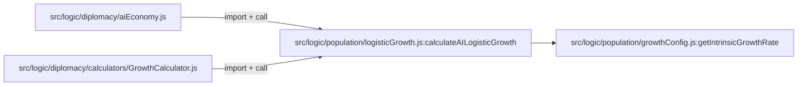
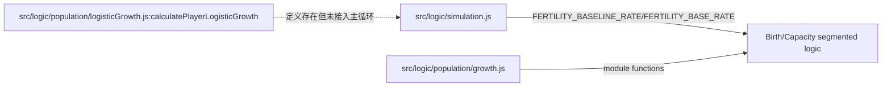

# Population Growth Model Alignment Report (2026-02-28)

## Scope & Non-Goals

### Scope
1. 对齐“人口增长相关文档”与当前代码现状。
2. 明确 AI 与玩家人口增长链路当前真实状态。
3. 输出可直接执行的文档修订任务单（按优先级）。

### Non-Goals
1. 不修改 `src/logic/simulation.js`、`src/logic/population/logisticGrowth.js` 等玩法代码。
2. 不调参（增长率/难度倍率/承载力参数不改）。
3. 不直接改历史文档正文（本轮仅新增对齐报告）。

---

## Code Truth Snapshot

### A. AI Population Growth Path (已逻辑斯蒂化)

代码证据：
1. `src/logic/diplomacy/aiEconomy.js:12` 导入 `calculateAILogisticGrowth`。
2. `src/logic/diplomacy/aiEconomy.js:278` 调用 `calculateAILogisticGrowth({...})`。
3. `src/logic/diplomacy/calculators/GrowthCalculator.js:6` 导入 `calculateAILogisticGrowth`。
4. `src/logic/diplomacy/calculators/GrowthCalculator.js:23` 调用 `calculateAILogisticGrowth({...})`。
5. `src/logic/population/logisticGrowth.js:205` 定义 AI 逻辑斯蒂入口。
6. `src/logic/population/logisticGrowth.js:324` AI 路径使用 `getIntrinsicGrowthRate('ai', tickScale)`。

结论：`MATCHED`（AI 侧“已逻辑斯蒂化”成立）。

### B. Player Population Growth Path (当前仍由主循环生育逻辑驱动)

代码证据：
1. `src/logic/simulation.js:6116` 明确注释“Population fertility calculations”。
2. `src/logic/simulation.js:6123` 使用 `FERTILITY_BASELINE_RATE`。
3. `src/logic/simulation.js:6147` 使用 `FERTILITY_BASE_RATE` 与 `populationGrowthBonus`。
4. `src/logic/population/logisticGrowth.js:399` 定义 `calculatePlayerLogisticGrowth`。
5. 全仓检索未发现 `calculatePlayerLogisticGrowth` 被主循环调用（仅定义处命中）。

结论：`MATCHED`（“玩家未迁移到主循环逻辑斯蒂”成立）。

### C. Test Coverage Snapshot

证据：在 `tests/` 下检索 `logisticGrowth|calculateAILogisticGrowth|calculatePlayerLogisticGrowth|calculateCarryingCapacity` 结果为 0 命中。

结论：`MATCHED`（当前缺少 `logisticGrowth.js` 直接单元测试覆盖）。

---

## Document Claim Matrix

| Document | Claim (摘要) | 代码证据 | Verdict |
|---|---|---|---|
| `docs/人口增长系统重构.md` | “AI 已完成，玩家待集成” (`:157`, `:181`, `:203`, `:238`) | AI 调用链命中；玩家主循环仍是生育逻辑 | MATCHED |
| `docs/逻辑斯蒂人口增长模型.md` | “AI 完整版逻辑斯蒂” (`:154`-`:160`) | `aiEconomy.js:278`, `GrowthCalculator.js:23` | MATCHED |
| `docs/逻辑斯蒂人口增长模型.md` | “玩家国家”章节给出调用方式 (`:234`) | 函数已定义 `logisticGrowth.js:399`，但主循环未接入 | PARTIALLY_MATCHED |
| `docs/人口增长模型可视化对比.md` | “新模型提供更科学/更平衡系统” (`:309`) | AI 路径成立；玩家主循环未全量迁移 | PARTIALLY_MATCHED |
| `docs/人口增长率统一配置.md` | “growthConfig 是所有增长率唯一来源” (`:19`) | 仍存在 `logisticGrowth.js` 内部硬编码倍率/阈值（如 `difficultyCapMap`, `smallNationBonus`） | OUTDATED |
| `docs/人口增长率统一配置.md` | 难度倍率表（hard=1.15, veryHard=1.3, impossible=1.5） | `growthConfig.js` 当前为 `hard=1.05`, `veryHard=1.1`, `impossible=1.2` | OUTDATED |

---

## Mismatch List (P0/P1/P2)

### P0 (误导实现决策)
1. `docs/人口增长率统一配置.md:19` 声称“唯一来源”，但代码实际仍有多个逻辑斯蒂内嵌修正参数（不全在 `growthConfig.js`）。
- 风险：开发者误以为只改配置文件即可完成全局调参。

### P1 (参数口径不一致)
1. `docs/人口增长率统一配置.md` 的难度倍率表与 `src/logic/population/growthConfig.js` 当前值不一致。
2. 同文档关于“统一增长率口径”的示例与 `logisticGrowth.js` AI/Player 实际计算路径存在偏差（如玩家路径仍有 `PLAYER_BASE / 10` 层处理，AI 还有 small nation bonus）。

### P2 (叙述层过时/模糊)
1. `docs/人口增长模型可视化对比.md` 结论使用“新模型总体替代”语气，未显式标注“AI 已切换、玩家未切换”。
2. `docs/逻辑斯蒂人口增长模型.md` 玩家章节更像“目标方案”，建议补充“当前是否已接入主循环”的状态标签。

---

## Recommended Edits (By File)

### 1) `docs/人口增长率统一配置.md`

- 目标段落：问题定义、配置说明、难度表、注意事项。  
- 当前问题：存在 P0/P1 冲突。  
- 建议新文案方向：
1. 将“唯一来源”改为“主增长率来源”；
2. 单列“仍在业务代码中的增长修正参数清单”（例如 AI carrying cap/difficulty cap/small nation bonus）；
3. 更新难度倍率表为当前代码值（`hard 1.05`, `veryHard 1.1`, `impossible 1.2`）。
- 风险：低（文档修正）。
- 影响范围：文档 + 参数调优决策准确性。

### 2) `docs/逻辑斯蒂人口增长模型.md`

- 目标段落：玩家国家章节、使用方法章节。  
- 当前问题：玩家章节未明确“当前是否已接入主循环”。  
- 建议新文案方向：
1. 在“玩家国家”标题后追加状态标签：`当前：函数已实现，主循环未接入`；
2. 增加“接入前提与风险”小节（回归点：人口、失业、粮食短缺、政策加成）。
- 风险：低。
- 影响范围：文档。

### 3) `docs/人口增长模型可视化对比.md`

- 目标段落：结论与策略影响。  
- 当前问题：整体结论易被理解为“玩家与 AI 全量已切换”。  
- 建议新文案方向：
1. 结论区补充“适用范围”行：`当前主要对应 AI 增长链路`；
2. 增加“玩家链路现状”脚注与指向文档。
- 风险：低。
- 影响范围：文档认知。

### 4) `docs/人口增长系统重构.md`

- 目标段落：总体状态、下一步。  
- 当前问题：总体准确，但建议加“最后校验日期与代码版本”防漂移。  
- 建议新文案方向：
1. 增加 `Last verified against commit` 字段；
2. 在“待完成”中给出验收条件（而非仅 TODO）。
- 风险：低。
- 影响范围：文档维护效率。

---

## Verification Checklist

### Consistency Checks
1. 每条代码事实都有文件行号证据：✅
2. 每条冲突项均能在原文定位：✅
3. P0/P1 均附带至少一条代码证据：✅

### Safety Checks
1. 基线回归命令：`npm run test -- tests/three-kingdoms`  
- 结果：`25 passed, 46 passed`，exit code `0`。
2. 本轮改动范围：仅新增本报告文件（不含代码改动）。

---

## Next Iteration Plan

1. 以本报告为任务单，执行“文档正文修订”批次（仅 docs）。
2. 增加 `logisticGrowth.js` 最小单元测试集（承载力、资源因子、AI/Player入口）以消除无测试区。
3. 若后续要推进玩家逻辑斯蒂迁移，单独开新计划文档，明确迁移前后兼容与回归基线。

